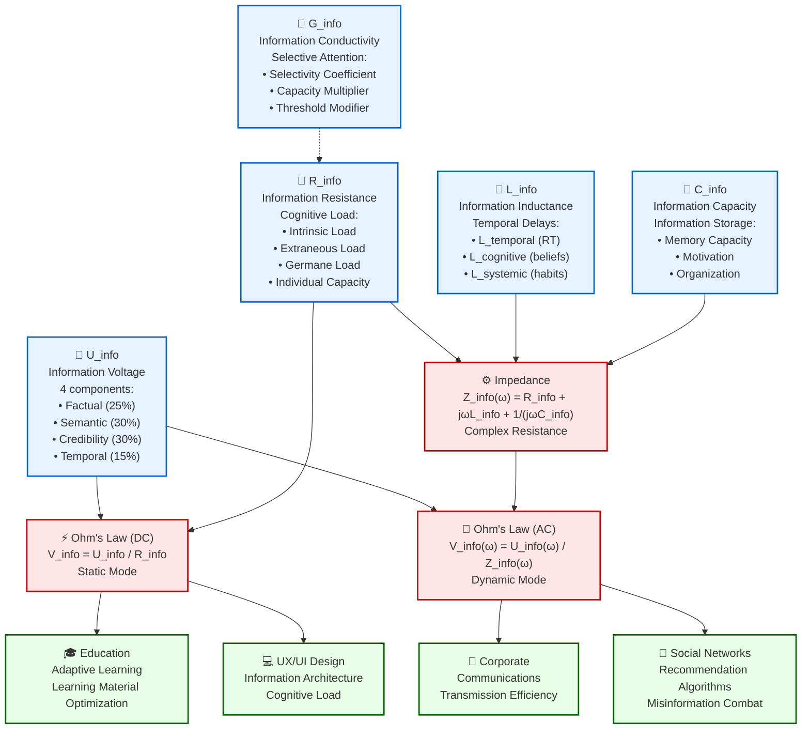

# Diagram 1: Complete Ohm's Law for Information

## Description
This diagram presents the complete formalization of Ohm's law for information flows, integrating all developed components of Information Dynamics theory.

## Mermaid Code for Diagram Generation



## Core Components

### 🔋 U_info - Information Voltage
- **Definition**: Quality and influence of information, driving force of information flow
- **Components** (4 dimensions):
  - **Factual (25%)**: Factual density and accuracy
  - **Semantic (30%)**: Semantic richness and clarity
  - **Credibility (30%)**: Source authority and trust
  - **Temporal (15%)**: Relevance and timeliness

### 🚧 R_info - Information Resistance  
- **Definition**: Obstacle to information passage, based on cognitive load
- **Based on Cognitive Load Theory**:
  - **Intrinsic Load**: Complexity of information itself
  - **Extraneous Load**: Interference and distracting factors
  - **Germane Load**: Effort on processing and integration
  - **Individual Capacity**: Individual cognitive capabilities

### 🌊 G_info - Information Conductivity
- **Definition**: Agent's ability to transmit information (G = 1/R)
- **Based on selective attention theory**:
  - **Selectivity Coefficient**: Perceptual selectivity
  - **Capacity Multiplier**: Throughput multiplier  
  - **Threshold Modifier**: Perception threshold modifier

### 🔄 L_info - Information Inductance
- **Definition**: Inertia of information processes, resistance to change
- **Three components**:
  - **L_temporal**: Processing temporal delays (reaction time)
  - **L_cognitive**: Cognitive inertia (belief persistence)
  - **L_systemic**: Systemic inertia (habits, traditions)

### 🏪 C_info - Information Capacity
- **Definition**: Ability to accumulate and store information
- **Factors**:
  - **Memory Capacity**: Memory volume
  - **Motivation**: Motivation to remember
  - **Organization**: Storage organization

## Laws and Formulas

### ⚡ Static Mode (DC)
```
V_info = U_info / R_info
```
- Applied to constant information flows
- Simple dependence of velocity on quality and resistance

### 🌊 Dynamic Mode (AC)  
```
V_info(ω) = U_info(ω) / Z_info(ω)
```
- Accounts for temporal changes and frequency characteristics
- Applied to changing information flows

### ⚙️ Complex Impedance
```
Z_info(ω) = R_info + jωL_info + 1/(jωC_info)
```
- Total resistance in dynamic mode
- Includes active resistance, inductive and capacitive

## Practical Applications

### 🎓 Education
- Adaptive learning systems
- Learning material optimization by cognitive load
- Content personalization for individual characteristics

### 💻 UX/UI Design
- Interface information architecture
- Cognitive load minimization
- User experience optimization

### 🏢 Corporate Communications
- Corporate message transmission efficiency
- Internal communication process optimization
- Information flow quality measurement

### 📱 Social Networks
- Recommendation system algorithms
- Misinformation and fake news combat
- Content strategy optimization

## How to Create the Diagram

1. Copy code from the Mermaid block
2. Paste into any Mermaid-supporting editor (e.g., Obsidian, Notion, GitHub)
3. Or use online editor: https://mermaid.live/
4. For SVG export: use export function in Mermaid Live Editor

## Related Project Files
- **Related theoretical models**: `theory/ohms_law_information.md`
- **Literature review**: `research/literature_review_1.1.1.md`, `research/literature_review_1.1.2.md`, `research/literature_review_1.1.3.md`, `research/literature_review_1.1.4.md` 