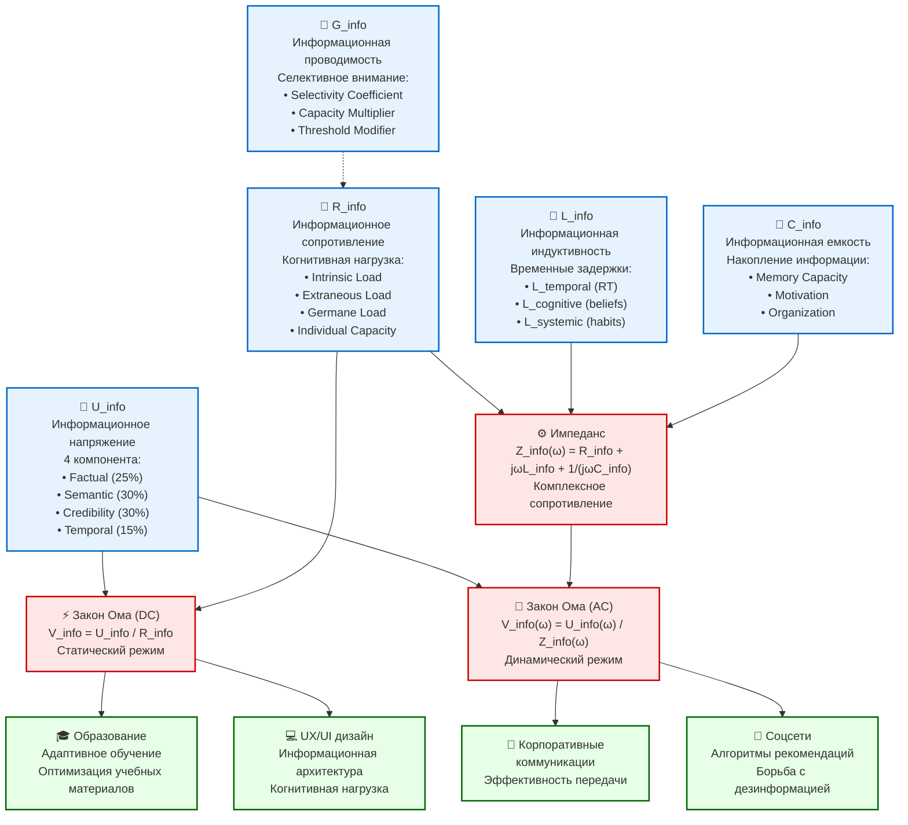

# Диаграмма 1: Полный закон Ома для информации

## Описание
Данная диаграмма представляет полную формализацию закона Ома для информационных потоков, интегрируя все разработанные компоненты теории Information Dynamics.

## Mermaid код для генерации диаграммы



## Основные компоненты

### 🔋 U_info - Информационное напряжение
- **Определение**: Качество и влиятельность информации, движущая сила информационного потока
- **Компоненты** (4 измерения):
  - **Factual (25%)**: Фактическая плотность и достоверность
  - **Semantic (30%)**: Семантическое богатство и ясность
  - **Credibility (30%)**: Авторитет источника и доверие
  - **Temporal (15%)**: Актуальность и своевременность

### 🚧 R_info - Информационное сопротивление  
- **Определение**: Препятствие для прохождения информации, основанное на когнитивной нагрузке
- **Базируется на Cognitive Load Theory**:
  - **Intrinsic Load**: Сложность самой информации
  - **Extraneous Load**: Помехи и отвлекающие факторы
  - **Germane Load**: Усилия на обработку и интеграцию
  - **Individual Capacity**: Индивидуальные когнитивные возможности

### 🌊 G_info - Информационная проводимость
- **Определение**: Способность агента пропускать информацию (G = 1/R)
- **Базируется на теории селективного внимания**:
  - **Selectivity Coefficient**: Избирательность восприятия
  - **Capacity Multiplier**: Множитель пропускной способности  
  - **Threshold Modifier**: Модификатор порога восприятия

### 🔄 L_info - Информационная индуктивность
- **Определение**: Инерция информационных процессов, сопротивление изменениям
- **Три компонента**:
  - **L_temporal**: Временные задержки обработки (reaction time)
  - **L_cognitive**: Когнитивная инерция (belief persistence)
  - **L_systemic**: Системная инерция (привычки, традиции)

### 🏪 C_info - Информационная емкость
- **Определение**: Способность накапливать и сохранять информацию
- **Факторы**:
  - **Memory Capacity**: Объем памяти
  - **Motivation**: Мотивация к запоминанию
  - **Organization**: Организованность хранения

## Законы и формулы

### ⚡ Статический режим (DC)
```
V_info = U_info / R_info
```
- Применяется для постоянных информационных потоков
- Простая зависимость скорости от качества и сопротивления

### 🌊 Динамический режим (AC)  
```
V_info(ω) = U_info(ω) / Z_info(ω)
```
- Учитывает временные изменения и частотные характеристики
- Применяется для изменяющихся информационных потоков

### ⚙️ Комплексный импеданс
```
Z_info(ω) = R_info + jωL_info + 1/(jωC_info)
```
- Полное сопротивление в динамическом режиме
- Включает активное сопротивление, индуктивное и емкостное

## Практические применения

### 🎓 Образование
- Адаптивные обучающие системы
- Оптимизация учебных материалов по когнитивной нагрузке
- Персонализация контента под индивидуальные характеристики

### 💻 UX/UI дизайн
- Информационная архитектура интерфейсов
- Минимизация когнитивной нагрузки
- Оптимизация пользовательского опыта

### 🏢 Корпоративные коммуникации
- Эффективность передачи корпоративных сообщений
- Оптимизация внутренних коммуникационных процессов
- Измерение качества информационных потоков

### 📱 Социальные сети
- Алгоритмы рекомендательных систем
- Борьба с дезинформацией и фейками
- Оптимизация контент-стратегий

## Как создать диаграмму

1. Скопируйте код из блока Mermaid
2. Вставьте в любой редактор, поддерживающий Mermaid (например, Obsidian, Notion, GitHub)
3. Или используйте онлайн-редактор: https://mermaid.live/
4. Для экспорта в SVG: используйте функцию экспорта в Mermaid Live Editor

## Файлы проекта
- **Связанные теоретические модели**: `theory/ohms_law_information.md`
- **Литературный обзор**: `research/literature_review_1.1.1.md`, `research/literature_review_1.1.2.md`, `research/literature_review_1.1.3.md`, `research/literature_review_1.1.4.md` 