# Diagram 2: Cognitive Architecture Integration with Information Dynamics

## Description
This diagram shows how existing cognitive architectures integrate with Information Dynamics theory components, creating a unified Cognitive-Information Architecture (UCIA).

## Mermaid Code for Diagram Generation

```mermaid
graph TD
    %% Cognitive architectures
    ACT["🧠 ACT-R<br/>Adaptive Control of Thought<br/>• Production rules<br/>• Memory buffers<br/>• Hybrid architecture"]
    
    EPIC["⚡ EPIC<br/>Executive Process-Interactive Control<br/>• Parallel processing<br/>• Executive control<br/>• Multiple resources"]
    
    GWT["🌐 Global Workspace Theory<br/>• Global broadcasting<br/>• Conscious access<br/>• Module coalitions"]
    
    PERCEIVER["🔄 Perceiver Architecture<br/>• Cross-attention mechanism<br/>• Universal architecture<br/>• Transformer-based"]
    
    UMM["🤖 Unified Mind Model<br/>• LLM-based<br/>• Multimodality<br/>• Cognitive modeling"]
    
    %% Information Dynamics components
    G_COMP["🌊 G_info<br/>Information Conductivity"]
    R_COMP["🚧 R_info<br/>Information Resistance"] 
    L_COMP["🔄 L_info<br/>Information Inductance"]
    C_COMP["🏪 C_info<br/>Information Capacity"]
    
    %% ACT-R connections
    ACT --> G_COMP
    ACT --> R_COMP
    ACT --> L_COMP
    ACT --> C_COMP
    
    %% EPIC connections
    EPIC --> G_COMP
    EPIC --> R_COMP
    
    %% GWT connections
    GWT --> G_COMP
    GWT --> C_COMP
    
    %% Perceiver connections
    PERCEIVER --> G_COMP
    PERCEIVER --> L_COMP
    
    %% UMM connections
    UMM --> G_COMP
    UMM --> R_COMP
    UMM --> L_COMP
    UMM --> C_COMP
    
    %% Integrative model
    UCIA["🔗 UCIA<br/>Unified Cognitive-Information Architecture<br/>Integrative model"]
    
    G_COMP --> UCIA
    R_COMP --> UCIA
    L_COMP --> UCIA  
    C_COMP --> UCIA
    
    %% Applications
    EDU["🎓 Education<br/>Adaptive learning<br/>Personalization"]
    
    UI["💻 Interfaces<br/>Cognitive ergonomics<br/>Usability"]
    
    AI["🤖 AI Systems<br/>Cognitive modeling<br/>Human-AI interaction"]
    
    UCIA --> EDU
    UCIA --> UI
    UCIA --> AI
    
    %% Styles
    classDef architecture fill:#E6F3FF,stroke:#0066CC,stroke-width:2px
    classDef component fill:#FFE6CC,stroke:#CC6600,stroke-width:2px
    classDef integration fill:#E6FFE6,stroke:#006600,stroke-width:2px
    classDef application fill:#FFE6F3,stroke:#CC0066,stroke-width:2px
    
    class ACT,EPIC,GWT,PERCEIVER,UMM architecture
    class G_COMP,R_COMP,L_COMP,C_COMP component
    class UCIA integration
    class EDU,UI,AI application
```

## Cognitive Architectures

### 🧠 ACT-R (Adaptive Control of Thought-Rational)
- **Type**: Hybrid symbolic-connectionist architecture
- **Key Features**:
  - Production rules for procedural knowledge
  - Specialized memory buffers (visual, auditory, goal)
  - Declarative and procedural memory
- **Information Dynamics Connection**: Most complete integration with all components G, R, L, C

### ⚡ EPIC (Executive Process-Interactive Control)  
- **Type**: Parallel processing architecture
- **Key Features**:
  - Executive control of cognitive processes
  - Multiple processing resources
  - Temporal constraints and scheduling
- **Information Dynamics Connection**: Focus on conductivity (G) and resistance (R)

### 🌐 Global Workspace Theory (GWT)
- **Type**: Global workspace architecture
- **Key Features**:
  - Global broadcasting between modules
  - Conscious access to information
  - Coalitions of specialized processors
- **Information Dynamics Connection**: Focus on conductivity (G) and capacity (C)

### 🔄 Perceiver Architecture
- **Type**: Modern neural network architecture
- **Key Features**:
  - Cross-attention Transformer mechanism
  - Universal modality processing
  - Scalability and flexibility
- **Information Dynamics Connection**: Conductivity (G) and inductance (L)

### 🤖 Unified Mind Model (UMM)
- **Type**: LLM-based cognitive architecture
- **Key Features**:
  - Multimodal processing
  - Language-based cognitive modeling
  - Integration of symbolic and connectionist approaches
- **Information Dynamics Connection**: Full integration of all components

## Component Correspondences

### 🌊 G_info - Information Conductivity
**Architectural correspondences:**
- **ACT-R**: Declarative memory activation, spreading activation
- **EPIC**: Perceptual processor throughput
- **GWT**: Global broadcasting efficiency
- **Perceiver**: Attention weights, cross-modal connectivity
- **UMM**: Token processing efficiency, context utilization

### 🚧 R_info - Information Resistance
**Architectural correspondences:**
- **ACT-R**: Cognitive effort, rule conflict resolution
- **EPIC**: Resource limitations, scheduling conflicts
- **GWT**: Modular isolation, bandwidth constraints
- **Perceiver**: Computational complexity, attention constraints
- **UMM**: Processing bottlenecks, context switching overhead

### 🔄 L_info - Information Inductance  
**Architectural correspondences:**
- **ACT-R**: Learning mechanisms, chunk strengthening
- **EPIC**: Temporal dynamics, scheduling inertia
- **GWT**: Coalition formation time, conscious access delay
- **Perceiver**: Sequence dependencies, temporal modeling
- **UMM**: Context persistence, memory consolidation

### 🏪 C_info - Information Capacity
**Architectural correspondences:**
- **ACT-R**: Declarative memory capacity, chunk limits
- **EPIC**: Buffer capacities, resource pools
- **GWT**: Global workspace capacity, broadcasting limits
- **Perceiver**: Context window, parameter capacity
- **UMM**: Working memory span, knowledge storage

## UCIA Integrative Model

### 🔗 Unified Cognitive-Information Architecture
**Integration principles:**

1. **Multi-level structure**:
   - Micro-level: Neural mechanisms
   - Meso-level: Cognitive processes  
   - Macro-level: Information flows

2. **Dynamic interaction**:
   - G ↔ R: Adaptive throughput regulation
   - L ↔ C: Temporal dynamics of information accumulation
   - All components: Mutual modulation

3. **Contextual adaptation**:
   - Task-dependent configuration
   - Individual differences
   - Environmental factors

## Practical Applications

### 🎓 Education
- **Adaptive learning systems**: Tuning to student's G, R, L, C parameters
- **Content personalization**: Information voltage optimization
- **Learning diagnostics**: Cognitive parameter measurement

### 💻 Interfaces and UX
- **Cognitive ergonomics**: R_info minimization, G_info optimization
- **Adaptive interfaces**: Dynamic user adaptation
- **Usability testing**: Quantitative cognitive load metrics

### 🤖 AI Systems
- **Human-AI interaction**: Cognitive architecture compatibility
- **Cognitive modeling**: Human information process simulation
- **Explainable AI**: Information Dynamics interpretation

## How to Create the Diagram

1. Copy code from the Mermaid block
2. Paste into any Mermaid-supporting editor
3. Or use online editor: https://mermaid.live/
4. For SVG export: use export function in Mermaid Live Editor

## Related Project Files
- **Related literature review**: `research/literature_review_1.2.1.md`
- **Theoretical models**: `theory/formal_model_conductivity.md`, `theory/formal_model_resistance.md`, `theory/formal_model_inductance.md` 