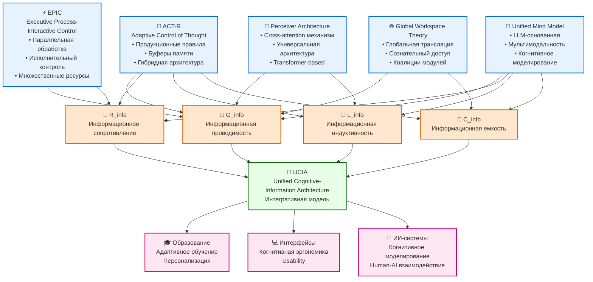

# Диаграмма 2: Интеграция когнитивных архитектур с Information Dynamics

## Описание
Данная диаграмма показывает, как существующие когнитивные архитектуры интегрируются с компонентами теории Information Dynamics, создавая единую Unified Cognitive-Information Architecture (UCIA).

## Mermaid код для генерации диаграммы

## Когнитивные архитектуры

### 🧠 ACT-R (Adaptive Control of Thought-Rational)
- **Тип**: Гибридная символьно-коннекционистская архитектура
- **Ключевые особенности**:
  - Продукционные правила для процедурного знания
  - Специализированные буферы памяти (visual, auditory, goal)
  - Декларативная и процедурная память
- **Связь с Information Dynamics**: Наиболее полная интеграция со всеми компонентами G, R, L, C

### ⚡ EPIC (Executive Process-Interactive Control)  
- **Тип**: Архитектура параллельной обработки
- **Ключевые особенности**:
  - Исполнительный контроль когнитивных процессов
  - Множественные ресурсы обработки
  - Временные ограничения и планирование
- **Связь с Information Dynamics**: Акцент на проводимости (G) и сопротивлении (R)

### 🌐 Global Workspace Theory (GWT)
- **Тип**: Архитектура глобального рабочего пространства
- **Ключевые особенности**:
  - Глобальная трансляция между модулями
  - Сознательный доступ к информации
  - Коалиции специализированных процессоров
- **Связь с Information Dynamics**: Фокус на проводимости (G) и емкости (C)

### 🔄 Perceiver Architecture
- **Тип**: Современная нейросетевая архитектура
- **Ключевые особенности**:
  - Cross-attention механизм Transformer
  - Универсальная обработка модальностей
  - Масштабируемость и гибкость
- **Связь с Information Dynamics**: Проводимость (G) и индуктивность (L)

### 🤖 Unified Mind Model (UMM)
- **Тип**: LLM-основанная когнитивная архитектура
- **Ключевые особенности**:
  - Мультимодальная обработка
  - Языковое когнитивное моделирование
  - Интеграция символьных и коннекционистских подходов
- **Связь с Information Dynamics**: Полная интеграция всех компонентов

## Соответствия компонентов

### 🌊 G_info - Информационная проводимость
**Соответствия в архитектурах:**
- **ACT-R**: Активация declarative memory, spreading activation
- **EPIC**: Пропускная способность перцептивных процессоров
- **GWT**: Эффективность глобальной трансляции
- **Perceiver**: Attention weights, cross-modal connectivity
- **UMM**: Token processing efficiency, context utilization

### 🚧 R_info - Информационное сопротивление
**Соответствия в архитектурах:**
- **ACT-R**: Cognitive effort, rule conflict resolution
- **EPIC**: Resource limitations, scheduling conflicts
- **GWT**: Модульная изоляция, ограничения bandwidth
- **Perceiver**: Computational complexity, attention constraints
- **UMM**: Processing bottlenecks, context switching overhead

### 🔄 L_info - Информационная индуктивность  
**Соответствия в архитектурах:**
- **ACT-R**: Learning mechanisms, chunk strengthening
- **EPIC**: Temporal dynamics, scheduling inertia
- **GWT**: Coalition formation time, conscious access delay
- **Perceiver**: Sequence dependencies, temporal modeling
- **UMM**: Context persistence, memory consolidation

### 🏪 C_info - Информационная емкость
**Соответствия в архитектурах:**
- **ACT-R**: Declarative memory capacity, chunk limits
- **EPIC**: Buffer capacities, resource pools
- **GWT**: Global workspace capacity, broadcasting limits
- **Perceiver**: Context window, parameter capacity
- **UMM**: Working memory span, knowledge storage

## Интегративная модель UCIA

### 🔗 Unified Cognitive-Information Architecture
**Принципы интеграции:**

1. **Многоуровневая структура**:
   - Микроуровень: Нейронные механизмы
   - Мезоуровень: Когнитивные процессы  
   - Макроуровень: Информационные потоки

2. **Динамическое взаимодействие**:
   - G ↔ R: Адаптивная регуляция пропускной способности
   - L ↔ C: Временная динамика накопления информации
   - Все компоненты: Взаимная модуляция

3. **Контекстная адаптация**:
   - Задачно-зависимая конфигурация
   - Индивидуальные различия
   - Средовые факторы

## Практические применения

### 🎓 Образование
- **Адаптивные обучающие системы**: Подстройка под G, R, L, C ученика
- **Персонализация контента**: Оптимизация информационного напряжения
- **Диагностика обучения**: Измерение когнитивных параметров

### 💻 Интерфейсы и UX
- **Когнитивная эргономика**: Минимизация R_info, оптимизация G_info
- **Адаптивные интерфейсы**: Динамическая подстройка под пользователя
- **Usability testing**: Количественные метрики когнитивной нагрузки

### 🤖 ИИ-системы
- **Human-AI взаимодействие**: Совместимость когнитивных архитектур
- **Когнитивное моделирование**: Симуляция человеческих информационных процессов
- **Explainable AI**: Интерпретация через Information Dynamics

## Как создать диаграмму

1. Скопируйте код из блока Mermaid
2. Вставьте в любой редактор, поддерживающий Mermaid
3. Или используйте онлайн-редактор: https://mermaid.live/
4. Для экспорта в SVG: используйте функцию экспорта в Mermaid Live Editor

## Файлы проекта
- **Связанный литературный обзор**: `research/literature_review_1.2.1.md`
- **Теоретические модели**: `theory/formal_model_conductivity.md`, `theory/formal_model_resistance.md`, `theory/formal_model_inductance.md` 