# Diagram 3: Social Networks and Information Conductivity

## Description
This diagram shows how social network phenomena (echo chambers, filter bubbles, selective exposure) integrate with Information Dynamics components to create a social model of information flows.

## Mermaid Code for Diagram Generation

```mermaid
graph TD
    %% Social phenomena
    ECHO["📢 Echo Chambers<br/>Echo Chambers<br/>• Homophily<br/>• Ideological isolation<br/>• Content repetition"]
    
    FILTER["🔍 Filter Bubbles<br/>Filter Bubbles<br/>• Algorithmic personalization<br/>• Selective exposure<br/>• Content predictability"]
    
    SELECTIVE["🎯 Selective Exposure<br/>Selective Exposure<br/>• Confirmation seeking<br/>• Dissonance avoidance<br/>• Motivated cognition"]
    
    %% Metrics
    H_INDEX["📊 Echo Chamber Metrics<br/>• Homophily index: H<br/>• Ideological isolation: I<br/>• Repetition: R<br/>Echo_strength = (H+I+R)/3"]
    
    F_INDEX["📊 Filter Bubble Metrics<br/>• Algorithmic isolation: A<br/>• Source diversity: D<br/>• Predictability: P<br/>Filter_strength = A×D×P"]
    
    S_INDEX["📊 Selectivity Metrics<br/>• Confirmation coefficient: C<br/>• Dissonance avoidance: A<br/>• Confirmation seeking: S"]
    
    %% Phenomena to metrics connections
    ECHO --> H_INDEX
    FILTER --> F_INDEX
    SELECTIVE --> S_INDEX
    
    %% Information Dynamics components
    G_SOCIAL["🌊 G_social<br/>Social Conductivity<br/>G = G_base × (1-Echo_strength) × (1-Filter_strength)<br/>× Openness_coefficient"]
    
    R_SOCIAL["🚧 R_social<br/>Social Resistance<br/>R = R_cognitive + R_network + R_algorithmic<br/>R_network = k1×Homophily + k2×Isolation"]
    
    L_SOCIAL["🔄 L_social<br/>Social Inductance<br/>L = L_individual + Group_think_delay<br/>+ Consensus_building_time"]
    
    %% Metrics to components connections
    H_INDEX --> R_SOCIAL
    H_INDEX --> G_SOCIAL
    
    F_INDEX --> R_SOCIAL
    F_INDEX --> G_SOCIAL
    
    S_INDEX --> G_SOCIAL
    S_INDEX --> L_SOCIAL
    
    %% Integrated model
    SOCIAL_MODEL["🔗 Integrated Model<br/>V_social(ω) = U_social(ω) / Z_social(ω)<br/>Z_social = R_social + jωL_social + 1/(jωC_social)"]
    
    G_SOCIAL --> SOCIAL_MODEL
    R_SOCIAL --> SOCIAL_MODEL
    L_SOCIAL --> SOCIAL_MODEL
    
    %% Practical applications
    PLATFORM["🏗️ Platforms<br/>• Echo chamber reduction<br/>• Personalization balance<br/>• Ecosystem health metrics"]
    
    EDUCATION["🎓 Education<br/>• Filter bubble overcoming<br/>• Critical thinking<br/>• Openness to new ideas"]
    
    CORPORATE["🏢 Corporations<br/>• Information silo diagnosis<br/>• Departmental echo chamber overcoming<br/>• Communication efficiency"]
    
    SOCIAL_MODEL --> PLATFORM
    SOCIAL_MODEL --> EDUCATION
    SOCIAL_MODEL --> CORPORATE
    
    %% Experimental predictions
    EXP1["🔬 Hypothesis 1<br/>G_info = k / (1 + Echo_strength)<br/>Test: Propagation speed<br/>vs group homophily"]
    
    EXP2["🔬 Hypothesis 2<br/>R_info = R_base × e^(Filter_strength)<br/>Test: A/B personalization<br/>vs reflection time"]
    
    EXP3["🔬 Hypothesis 3<br/>L_social ∝ log(group_size)<br/>Test: Group size<br/>vs decision time"]
    
    SOCIAL_MODEL --> EXP1
    SOCIAL_MODEL --> EXP2
    SOCIAL_MODEL --> EXP3
    
    %% Styles
    classDef phenomenon fill:#FFE6E6,stroke:#CC0000,stroke-width:2px
    classDef metrics fill:#E6F3FF,stroke:#0066CC,stroke-width:2px
    classDef component fill:#FFE6CC,stroke:#CC6600,stroke-width:2px
    classDef integration fill:#E6FFE6,stroke:#006600,stroke-width:2px
    classDef application fill:#F0E6FF,stroke:#6600CC,stroke-width:2px
    classDef experiment fill:#FFFACD,stroke:#DAA520,stroke-width:2px
    
    class ECHO,FILTER,SELECTIVE phenomenon
    class H_INDEX,F_INDEX,S_INDEX metrics
    class G_SOCIAL,R_SOCIAL,L_SOCIAL component
    class SOCIAL_MODEL integration
    class PLATFORM,EDUCATION,CORPORATE application
    class EXP1,EXP2,EXP3 experiment
```



## Social Phenomena

### 📢 Echo Chambers
- **Definition**: Environments where people encounter only information reflecting their beliefs
- **Key Mechanisms**:
  - **Homophily**: Preference for like-minded individuals
  - **Ideological Isolation**: Limiting source diversity
  - **Content Repetition**: Circulation of the same ideas

### 🔍 Filter Bubbles
- **Definition**: Algorithmic personalization creating unique information universes
- **Key Mechanisms**:
  - **Algorithmic Personalization**: Machine learning of preferences
  - **Selective Exposure**: Serving relevant content
  - **Content Predictability**: High accuracy of interest prediction

### 🎯 Selective Exposure
- **Definition**: Tendency to seek information confirming existing beliefs
- **Key Mechanisms**:
  - **Confirmation Seeking**: Active search for supporting data
  - **Dissonance Avoidance**: Avoiding contradictory information
  - **Motivated Cognition**: Biased information processing

## Quantitative Metrics

### 📊 Echo Chamber Metrics
```
Homophily index: H = same_opinion_connections / total_connections
Ideological isolation: I = 1 - cross_ideology_exposure / total_exposure  
Repetition: R = repeated_messages / unique_messages
Echo_strength = (H + I + R) / 3
```

### 📊 Filter Bubble Metrics
```
Algorithmic isolation: A = personalized_content / total_content
Source diversity: D = 1 - Shannon_entropy(source_distribution)
Predictability: P = accuracy_of_content_prediction
Filter_strength = A × D × P
```

### 📊 Selectivity Metrics
```
Confirmation coefficient: C = confirming_content_time / total_content_time
Dissonance avoidance: A = 1 - challenging_content_engagement / total_engagement
Confirmation seeking: S = confirmation_seeking_behavior / exploration_behavior
```

## Information Dynamics Components

### 🌊 G_social - Social Conductivity
```
G_social = G_base × Network_effect × Algorithm_effect × User_effect

where:
Network_effect = (1 - Echo_strength) × (1 - Filter_strength)
Algorithm_effect = Diversity_index × Recommendation_neutrality  
User_effect = Openness_coefficient × Curiosity_index
```

### 🚧 R_social - Social Resistance
```
R_social = R_cognitive + R_network + R_algorithmic

where:
R_cognitive = user's baseline cognitive resistance
R_network = k1 × Homophily_index + k2 × Ideological_isolation
R_algorithmic = k3 × Personalization_degree + k4 × Filter_strength
```

### 🔄 L_social - Social Inductance
```
L_social = L_individual + Group_think_delay + Consensus_building_time

where:
Group_think_delay = group_size × agreement_degree
Consensus_building_time = decision_complexity / collective_intelligence
```

## Integrated Model

### 🔗 Social Ohm's Law
```
V_social(ω) = U_social(ω) / Z_social(ω)

where:
Z_social(ω) = R_social + jωL_social + 1/(jωC_social)
```

**Physical meaning:**
- **V_social**: Information propagation speed in social networks
- **U_social**: Social information voltage (influence + quality)
- **Z_social**: Complex social impedance

## Practical Applications

### 🏗️ Platform Optimization
- **Echo chamber reduction**: Target G_social = 0.7-0.8
- **Personalization balance**: Optimal balance of relevance and diversity
- **Ecosystem health metrics**: Monitoring Echo_strength and Filter_strength

### 🎓 Educational Systems
- **Filter bubble overcoming**: Forced source diversity
- **Critical thinking**: R_social reduction through training
- **Openness to new ideas**: G_social enhancement through practice

### 🏢 Corporate Communications
- **Silo diagnosis**: Measuring R_network between departments
- **Echo chamber overcoming**: Cross-functional teams
- **Communication efficiency**: Information flow optimization

## Experimental Predictions

### 🔬 Hypothesis 1: Inverse relationship between conductivity and echo chambers
```
Prediction: G_info = k / (1 + Echo_strength)
Test: Measure neutral information propagation speed 
      in groups with varying homophily degrees
Expected result: r < -0.6, p < 0.01
```

### 🔬 Hypothesis 2: Exponential resistance growth from filter bubbles
```
Prediction: R_info = R_base × e^(Filter_strength)
Test: A/B testing with different personalization levels
      Measure reflection time and skepticism
Expected result: Exponential relationship
```

### 🔬 Hypothesis 3: Logarithmic inductance growth with group size
```
Prediction: L_social ∝ log(group_size)
Test: Measure decision time in groups of 2-200 people
Expected result: Logarithmic dependency of consensus time
```

## Validation Criteria

### Quantitative metrics:
1. **G_social correlation with propagation speed**: r > 0.6
2. **R_social correlation with reflection time**: r > 0.5  
3. **Model predictive power**: R² > 0.4

### Qualitative criteria:
1. Correspondence with observed social phenomena
2. Practical applicability in platform design
3. Integration with existing social theories

## How to Create the Diagram

1. Copy code from the Mermaid block
2. Paste into any Mermaid-supporting editor
3. Or use online editor: https://mermaid.live/
4. For SVG export: use export function in Mermaid Live Editor

## Related Project Files
- **Related literature review**: `research/literature_review_1.2.2.md`
- **Theoretical models**: `theory/formal_model_conductivity.md`, `theory/formal_model_resistance.md`
- **Core law**: `theory/ohms_law_information.md` 