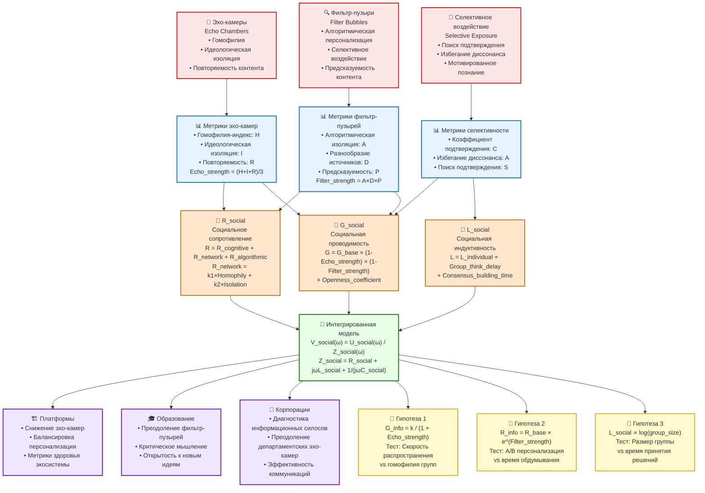

# Диаграмма 3: Социальные сети и информационная проводимость

## Описание
Данная диаграмма показывает, как феномены социальных сетей (эхо-камеры, фильтр-пузыри, селективное воздействие) интегрируются с компонентами Information Dynamics для создания социальной модели информационных потоков.

## Mermaid код для генерации диаграммы



## Социальные феномены

### 📢 Эхо-камеры (Echo Chambers)
- **Определение**: Среды, где люди встречают только информацию, отражающую их убеждения
- **Ключевые механизмы**:
  - **Гомофилия**: Предпочтение единомышленников
  - **Идеологическая изоляция**: Ограничение разнообразия источников
  - **Повторяемость контента**: Циркуляция одних и тех же идей

### 🔍 Фильтр-пузыри (Filter Bubbles)  
- **Определение**: Алгоритмическая персонализация, создающая уникальную информационную вселенную
- **Ключевые механизмы**:
  - **Алгоритмическая персонализация**: Машинное обучение предпочтений
  - **Селективное воздействие**: Подача релевантного контента
  - **Предсказуемость контента**: Высокая точность прогнозирования интересов

### 🎯 Селективное воздействие (Selective Exposure)
- **Определение**: Тенденция искать информацию, подтверждающую существующие убеждения
- **Ключевые механизмы**:
  - **Поиск подтверждения**: Активный поиск поддерживающих данных
  - **Избегание диссонанса**: Уклонение от противоречащей информации
  - **Мотивированное познание**: Предвзятая обработка информации

## Количественные метрики

### 📊 Метрики эхо-камер
```
Гомофилия-индекс: H = same_opinion_connections / total_connections
Идеологическая изоляция: I = 1 - cross_ideology_exposure / total_exposure  
Повторяемость: R = repeated_messages / unique_messages
Echo_strength = (H + I + R) / 3
```

### 📊 Метрики фильтр-пузырей
```
Алгоритмическая изоляция: A = personalized_content / total_content
Разнообразие источников: D = 1 - Shannon_entropy(source_distribution)
Предсказуемость: P = accuracy_of_content_prediction
Filter_strength = A × D × P
```

### 📊 Метрики селективности
```
Коэффициент подтверждения: C = confirming_content_time / total_content_time
Избегание диссонанса: A = 1 - challenging_content_engagement / total_engagement
Поиск подтверждения: S = confirmation_seeking_behavior / exploration_behavior
```

## Компоненты Information Dynamics

### 🌊 G_social - Социальная проводимость
```
G_social = G_base × Network_effect × Algorithm_effect × User_effect

где:
Network_effect = (1 - Echo_strength) × (1 - Filter_strength)
Algorithm_effect = Diversity_index × Recommendation_neutrality  
User_effect = Openness_coefficient × Curiosity_index
```

### 🚧 R_social - Социальное сопротивление
```
R_social = R_cognitive + R_network + R_algorithmic

где:
R_cognitive = базовое когнитивное сопротивление пользователя
R_network = k1 × Homophily_index + k2 × Ideological_isolation
R_algorithmic = k3 × Personalization_degree + k4 × Filter_strength
```

### 🔄 L_social - Социальная индуктивность
```
L_social = L_individual + Group_think_delay + Consensus_building_time

где:
Group_think_delay = размер_группы × степень_согласованности
Consensus_building_time = сложность_решения / коллективный_интеллект
```

## Интегрированная модель

### 🔗 Социальный закон Ома
```
V_social(ω) = U_social(ω) / Z_social(ω)

где:
Z_social(ω) = R_social + jωL_social + 1/(jωC_social)
```

**Физический смысл:**
- **V_social**: Скорость распространения информации в социальной сети
- **U_social**: Социальное информационное напряжение (влиятельность + качество)
- **Z_social**: Комплексное социальное сопротивление

## Практические применения

### 🏗️ Оптимизация платформ
- **Снижение эхо-камер**: Целевая G_social = 0.7-0.8
- **Балансировка персонализации**: Оптимальный баланс релевантности и разнообразия
- **Метрики здоровья экосистемы**: Мониторинг Echo_strength и Filter_strength

### 🎓 Образовательные системы
- **Преодоление фильтр-пузырей**: Принудительное разнообразие источников
- **Критическое мышление**: Снижение R_social через тренировку
- **Открытость к новым идеям**: Повышение G_social через практику

### 🏢 Корпоративные коммуникации
- **Диагностика силосов**: Измерение R_network между отделами
- **Преодоление эхо-камер**: Кросс-функциональные команды
- **Эффективность коммуникаций**: Оптимизация информационных потоков

## Экспериментальные предсказания

### 🔬 Гипотеза 1: Обратная зависимость проводимости от эхо-камер
```
Предсказание: G_info = k / (1 + Echo_strength)
Тест: Измерить скорость распространения нейтральной информации 
      в группах с разной степенью гомофилии
Ожидаемый результат: r < -0.6, p < 0.01
```

### 🔬 Гипотеза 2: Экспоненциальный рост сопротивления от фильтр-пузырей
```
Предсказание: R_info = R_base × e^(Filter_strength)
Тест: A/B тестирование с разными уровнями персонализации
      Измерить время обдумывания и скептицизм
Ожидаемый результат: Экспоненциальная зависимость
```

### 🔬 Гипотеза 3: Логарифмический рост индуктивности от размера группы
```
Предсказание: L_social ∝ log(group_size)
Тест: Измерить время принятия решений в группах 2-200 человек
Ожидаемый результат: Логарифмическая зависимость времени консенсуса
```

## Валидационные критерии

### Количественные метрики:
1. **Корреляция G_social с скоростью распространения**: r > 0.6
2. **Корреляция R_social с временем обдумывания**: r > 0.5  
3. **Предсказательная способность модели**: R² > 0.4

### Качественные критерии:
1. Соответствие наблюдаемым социальным феноменам
2. Практическая применимость в дизайне платформ
3. Интегрируемость с существующими социальными теориями

## Как создать диаграмму

1. Скопируйте код из блока Mermaid
2. Вставьте в любой редактор, поддерживающий Mermaid
3. Или используйте онлайн-редактор: https://mermaid.live/
4. Для экспорта в SVG: используйте функцию экспорта в Mermaid Live Editor

## Файлы проекта
- **Связанный литературный обзор**: `research/literature_review_1.2.2.md`
- **Теоретические модели**: `theory/formal_model_conductivity.md`, `theory/formal_model_resistance.md`
- **Основной закон**: `theory/ohms_law_information.md` 