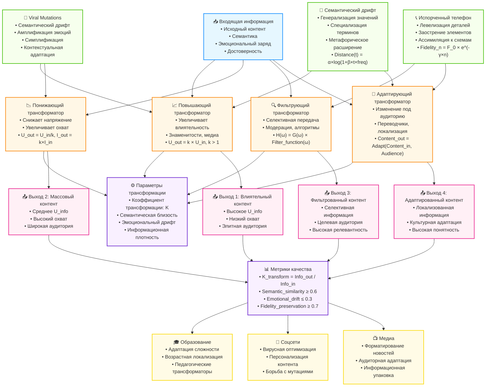

# Диаграмма 4: Информационные трансформаторы и трансформация контента

## Описание
Данная диаграмма показывает концепцию информационных трансформаторов и механизмы трансформации контента при передаче через агентов, включая viral mutations и семантический дрифт.

## Mermaid код для генерации диаграммы



## Типы информационных трансформаторов

### 📈 Повышающие трансформаторы (Step-up)
- **Функция**: Увеличивают "напряжение" (влиятельность) информации
- **Примеры**: Знаменитости, медиа-платформы, влиятельные блогеры
- **Модель**: `U_out = k × U_in`, где k > 1
- **Эффект**: Высокое влияние на ограниченную аудиторию

### 📉 Понижающие трансформаторы (Step-down)  
- **Функция**: Снижают "напряжение", но увеличивают "ток" (охват)
- **Примеры**: Упрощающие пересказы, популяризация науки
- **Модель**: `U_out = U_in / k`, `I_out = k × I_in`
- **Эффект**: Широкий охват при сниженном влиянии на единицу

### 🔍 Фильтрующие трансформаторы
- **Функция**: Селективная передача определенных компонентов
- **Примеры**: Модерация контента, алгоритмическая фильтрация
- **Модель**: `H(ω) = G(ω) × Filter_function(ω)`
- **Эффект**: Высокая релевантность для целевой аудитории

### 🎯 Адаптирующие трансформаторы
- **Функция**: Изменение контента под целевую аудиторию
- **Примеры**: Переводчики, локализаторы, образовательные адаптации
- **Модель**: `Content_out = Adapt(Content_in, Target_audience)`
- **Эффект**: Максимальная понятность и культурная релевантность

## Механизмы трансформации

### 🦠 Viral Mutations (Вирусные мутации)
- **Семантический дрифт**: Изменение смысла при сохранении формы
- **Амплификация**: Усиление эмоциональных аспектов
- **Симплификация**: Упрощение сложных концепций
- **Контекстуальная адаптация**: Приспособление к локальным особенностям

### 📞 "Испорченный телефон" (Transmission Chain Errors)
- **Левелизация** (Levelling): Сглаживание деталей
- **Заострение** (Sharpening): Акцентирование запоминающихся элементов  
- **Ассимиляция** (Assimilation): Приспособление к культурным схемам
- **Модель деградации**: `Fidelity_n = Fidelity_0 × e^(-γ × n)`

### 📖 Семантический дрифт
- **Генерализация**: Расширение области применения
- **Специализация**: Сужение значения
- **Метафорическое расширение**: Перенос на новые домены
- **Модель дрифта**: `Semantic_distance(t) = α × log(1 + β × t × usage_frequency)`

## Параметры трансформации

### ⚙️ Количественные метрики
```
Коэффициент трансформации: K_transform = Information_output / Information_input

K_transform > 1: Обогащение информации (комментарии, контекст)
K_transform = 1: Идеальная передача  
K_transform < 1: Потеря информации (сжатие, упрощение)
```

### 📊 Метрики качества
- **Семантическая близость**: `cosine_similarity ≥ 0.6`
- **Эмоциональный дрифт**: `|sentiment_drift| ≤ 0.3`
- **Сохранность точности**: `fidelity_preservation ≥ 0.7`
- **Информационная плотность**: `fact_density_ratio`

## Матрица трансформации

### Многомерное представление
```
[Semantic_out]     [k11  k12  k13] [Semantic_in]
[Emotional_out]  = [k21  k22  k23] [Emotional_in]  
[Credibility_out]  [k31  k32  k33] [Credibility_in]
```

**Интерпретация коэффициентов:**
- `k11`: Сохранение семантики
- `k12`: Влияние эмоций на семантику  
- `k23`: Эмоциональное усиление/ослабление
- `k31, k32, k33`: Изменение доверия

## Практические применения

### 🎓 Образование
- **Адаптация сложности**: Автоматическое упрощение для разных уровней
- **Возрастная локализация**: Адаптация контента под возрастные группы
- **Педагогические трансформаторы**: Оптимизация для учебных целей

### 📱 Социальные сети
- **Вирусная оптимизация**: Прогнозирование и контроль мутаций
- **Персонализация контента**: Адаптивные трансформаторы для пользователей
- **Борьба с дезинформацией**: Детекция и коррекция искажений

### 📺 Медиа и журналистика
- **Форматирование новостей**: Адаптация под разные платформы
- **Аудиторная адаптация**: Контент для разных демографических групп
- **Информационная упаковка**: Оптимизация подачи сложной информации

## Экспериментальные методики

### Тест 1: Измерение коэффициента трансформации
```python
def measure_transformation_coefficient(original, transformed):
    semantic_similarity = calculate_cosine_similarity(
        embed(original), embed(transformed)
    )
    emotional_shift = abs(sentiment_score(original) - sentiment_score(transformed))
    information_density_ratio = count_facts(transformed) / count_facts(original)
    
    return {
        'semantic_preservation': semantic_similarity,
        'emotional_drift': emotional_shift,
        'information_compression': information_density_ratio
    }
```

### Тест 2: Эксперимент "цифрового испорченного телефона"
```python
def digital_telephone_experiment(initial_message, chain_length=10):
    current_message = initial_message
    transformations = []
    
    for i in range(chain_length):
        transformed = simulate_human_retelling(current_message)
        change_metrics = measure_transformation_coefficient(current_message, transformed)
        transformations.append(change_metrics)
        current_message = transformed
    
    return transformations, current_message
```

## Как создать диаграмму

1. Скопируйте код из блока Mermaid
2. Вставьте в любой редактор, поддерживающий Mermaid
3. Или используйте онлайн-редактор: https://mermaid.live/
4. Для экспорта в SVG: используйте функцию экспорта в Mermaid Live Editor

## Файлы проекта
- **Связанный литературный обзор**: `research/literature_review_1.2.3.md`
- **Теоретические модели**: `theory/ohms_law_information.md`
- **Социальные сети**: `research/literature_review_1.2.2.md` 