# Diagram 4: Information Transformers and Content Transformation

## Description
This diagram shows the concept of information transformers and content transformation mechanisms during transmission through agents, including viral mutations and semantic drift.

## Mermaid Code for Diagram Generation

```mermaid
graph TD
    %% Input information
    INPUT["📥 Input Information<br/>• Original content<br/>• Semantics<br/>• Emotional charge<br/>• Credibility"]
    
    %% Transformer types
    STEP_UP["📈 Step-up Transformer<br/>• Increases influence<br/>• Celebrities, media<br/>• U_out = k × U_in, k > 1"]
    
    STEP_DOWN["📉 Step-down Transformer<br/>• Reduces voltage<br/>• Increases reach<br/>• U_out = U_in/k, I_out = k×I_in"]
    
    FILTER["🔍 Filtering Transformer<br/>• Selective transmission<br/>• Moderation, algorithms<br/>• H(ω) = G(ω) × Filter_function(ω)"]
    
    ADAPTIVE["🎯 Adaptive Transformer<br/>• Audience adaptation<br/>• Translation, localization<br/>• Content_out = Adapt(Content_in, Audience)"]
    
    %% Transformation mechanisms
    VIRAL["🦠 Viral Mutations<br/>• Semantic drift<br/>• Emotional amplification<br/>• Simplification<br/>• Contextual adaptation"]
    
    TELEPHONE["📞 Broken Telephone<br/>• Detail leveling<br/>• Element sharpening<br/>• Schema assimilation<br/>• Fidelity_n = F_0 × e^(-γ×n)"]
    
    SEMANTIC["📖 Semantic Drift<br/>• Meaning generalization<br/>• Term specialization<br/>• Metaphoric extension<br/>• Distance(t) = α×log(1+β×t×freq)"]
    
    %% Input connections
    INPUT --> STEP_UP
    INPUT --> STEP_DOWN
    INPUT --> FILTER
    INPUT --> ADAPTIVE
    
    %% Mechanisms affect transformers
    VIRAL --> STEP_UP
    VIRAL --> STEP_DOWN
    TELEPHONE --> FILTER
    TELEPHONE --> ADAPTIVE
    SEMANTIC --> STEP_UP
    SEMANTIC --> ADAPTIVE
    
    %% Transformation parameters
    PARAMS["⚙️ Transformation Parameters<br/>• Transformation coefficient: K<br/>• Semantic similarity<br/>• Emotional drift<br/>• Information density"]
    
    STEP_UP --> PARAMS
    STEP_DOWN --> PARAMS
    FILTER --> PARAMS
    ADAPTIVE --> PARAMS
    
    %% Output information
    OUTPUT1["📤 Output 1: Influential Content<br/>• High U_info<br/>• Low reach<br/>• Elite audience"]
    
    OUTPUT2["📤 Output 2: Mass Content<br/>• Medium U_info<br/>• High reach<br/>• Broad audience"]
    
    OUTPUT3["📤 Output 3: Filtered Content<br/>• Selective information<br/>• Target audience<br/>• High relevance"]
    
    OUTPUT4["📤 Output 4: Adapted Content<br/>• Localized information<br/>• Cultural adaptation<br/>• High comprehensibility"]
    
    %% Output connections
    STEP_UP --> OUTPUT1
    STEP_DOWN --> OUTPUT2
    FILTER --> OUTPUT3
    ADAPTIVE --> OUTPUT4
    
    %% Quality measurements
    QUALITY["📊 Quality Metrics<br/>• K_transform = Info_out / Info_in<br/>• Semantic_similarity ≥ 0.6<br/>• Emotional_drift ≤ 0.3<br/>• Fidelity_preservation ≥ 0.7"]
    
    OUTPUT1 --> QUALITY
    OUTPUT2 --> QUALITY
    OUTPUT3 --> QUALITY
    OUTPUT4 --> QUALITY
    
    %% Applications
    APP1["🎓 Education<br/>• Complexity adaptation<br/>• Age localization<br/>• Pedagogical transformers"]
    
    APP2["📱 Social Networks<br/>• Viral optimization<br/>• Content personalization<br/>• Mutation combat"]
    
    APP3["📺 Media<br/>• News formatting<br/>• Audience adaptation<br/>• Information packaging"]
    
    QUALITY --> APP1
    QUALITY --> APP2
    QUALITY --> APP3
    
    %% Styles
    classDef input fill:#E6F7FF,stroke:#1890FF,stroke-width:2px
    classDef transformer fill:#FFF7E6,stroke:#FA8C16,stroke-width:2px
    classDef mechanism fill:#F6FFED,stroke:#52C41A,stroke-width:2px
    classDef output fill:#FFF0F6,stroke:#EB2F96,stroke-width:2px
    classDef quality fill:#F9F0FF,stroke:#722ED1,stroke-width:2px
    classDef application fill:#FFFBE6,stroke:#FADB14,stroke-width:2px
    
    class INPUT input
    class STEP_UP,STEP_DOWN,FILTER,ADAPTIVE transformer
    class VIRAL,TELEPHONE,SEMANTIC mechanism
    class OUTPUT1,OUTPUT2,OUTPUT3,OUTPUT4 output
    class PARAMS,QUALITY quality
    class APP1,APP2,APP3 application
```



## Types of Information Transformers

### 📈 Step-up Transformers
- **Function**: Increase information "voltage" (influence)
- **Examples**: Celebrities, media platforms, influential bloggers
- **Model**: `U_out = k × U_in`, where k > 1
- **Effect**: High influence on limited audience

### 📉 Step-down Transformers  
- **Function**: Reduce "voltage" but increase "current" (reach)
- **Examples**: Simplifying retellings, science popularization
- **Model**: `U_out = U_in / k`, `I_out = k × I_in`
- **Effect**: Wide reach with reduced per-unit influence

### 🔍 Filtering Transformers
- **Function**: Selective transmission of specific components
- **Examples**: Content moderation, algorithmic filtering
- **Model**: `H(ω) = G(ω) × Filter_function(ω)`
- **Effect**: High relevance for target audience

### 🎯 Adaptive Transformers
- **Function**: Content modification for target audience
- **Examples**: Translators, localizers, educational adaptations
- **Model**: `Content_out = Adapt(Content_in, Target_audience)`
- **Effect**: Maximum comprehensibility and cultural relevance

## Transformation Mechanisms

### 🦠 Viral Mutations
- **Semantic Drift**: Meaning change while preserving form
- **Amplification**: Emotional aspect enhancement
- **Simplification**: Complex concept reduction
- **Contextual Adaptation**: Local characteristic accommodation

### 📞 "Broken Telephone" (Transmission Chain Errors)
- **Levelling**: Detail smoothing
- **Sharpening**: Memorable element emphasis  
- **Assimilation**: Cultural schema adaptation
- **Degradation Model**: `Fidelity_n = Fidelity_0 × e^(-γ × n)`

### 📖 Semantic Drift
- **Generalization**: Application domain expansion
- **Specialization**: Meaning narrowing
- **Metaphoric Extension**: Transfer to new domains
- **Drift Model**: `Semantic_distance(t) = α × log(1 + β × t × usage_frequency)`

## Transformation Parameters

### ⚙️ Quantitative Metrics
```
Transformation coefficient: K_transform = Information_output / Information_input

K_transform > 1: Information enrichment (comments, context)
K_transform = 1: Perfect transmission  
K_transform < 1: Information loss (compression, simplification)
```

### 📊 Quality Metrics
- **Semantic similarity**: `cosine_similarity ≥ 0.6`
- **Emotional drift**: `|sentiment_drift| ≤ 0.3`
- **Fidelity preservation**: `fidelity_preservation ≥ 0.7`
- **Information density**: `fact_density_ratio`

## Transformation Matrix

### Multidimensional Representation
```
[Semantic_out]     [k11  k12  k13] [Semantic_in]
[Emotional_out]  = [k21  k22  k23] [Emotional_in]  
[Credibility_out]  [k31  k32  k33] [Credibility_in]
```

**Coefficient Interpretation:**
- `k11`: Semantic preservation
- `k12`: Emotional influence on semantics  
- `k23`: Emotional enhancement/attenuation
- `k31, k32, k33`: Trust modification

## Practical Applications

### 🎓 Education
- **Complexity adaptation**: Automatic simplification for different levels
- **Age localization**: Content adaptation for age groups
- **Pedagogical transformers**: Educational purpose optimization

### 📱 Social Networks
- **Viral optimization**: Mutation prediction and control
- **Content personalization**: Adaptive transformers for users
- **Misinformation combat**: Distortion detection and correction

### 📺 Media and Journalism
- **News formatting**: Platform adaptation
- **Audience adaptation**: Content for different demographics
- **Information packaging**: Complex information delivery optimization

## Experimental Methods

### Test 1: Transformation Coefficient Measurement
```python
def measure_transformation_coefficient(original, transformed):
    semantic_similarity = calculate_cosine_similarity(
        embed(original), embed(transformed)
    )
    emotional_shift = abs(sentiment_score(original) - sentiment_score(transformed))
    information_density_ratio = count_facts(transformed) / count_facts(original)
    
    return {
        'semantic_preservation': semantic_similarity,
        'emotional_drift': emotional_shift,
        'information_compression': information_density_ratio
    }
```

### Test 2: Digital Broken Telephone Experiment
```python
def digital_telephone_experiment(initial_message, chain_length=10):
    current_message = initial_message
    transformations = []
    
    for i in range(chain_length):
        transformed = simulate_human_retelling(current_message)
        change_metrics = measure_transformation_coefficient(current_message, transformed)
        transformations.append(change_metrics)
        current_message = transformed
    
    return transformations, current_message
```

## How to Create the Diagram

1. Copy code from the Mermaid block
2. Paste into any Mermaid-supporting editor
3. Or use online editor: https://mermaid.live/
4. For SVG export: use export function in Mermaid Live Editor

## Related Project Files
- **Related literature review**: `research/literature_review_1.2.3.md`
- **Theoretical models**: `theory/ohms_law_information.md`
- **Social networks**: `research/literature_review_1.2.2.md` 