# Диаграмма 5: Обзор прогресса проекта Information Dynamics

## Описание
Данная диаграмма показывает общий прогресс выполнения проекта по исследованию Information Dynamics, завершенные этапы и следующие приоритеты.

## Mermaid код для генерации диаграммы

```mermaid
graph TD
    %% Завершенные задачи раздела 1.1
    A["🎯 ЭТАП 1.1 ЗАВЕРШЕН<br/>Базовые концепции"]
    
    B["✅ 1.1.1<br/>Информационное напряжение<br/>• Cognitive load<br/>• Information pressure<br/>• Концептуальные мосты"]
    
    C["✅ 1.1.2<br/>Когнитивное сопротивление<br/>• Broadbent filter model<br/>• CLT формализация<br/>• Resistance models"]
    
    D["✅ 1.1.3<br/>Информационная индуктивность<br/>• Mental chronometry<br/>• Belief persistence<br/>• Path dependence"]
    
    E["✅ 1.1.4<br/>Качество информации<br/>• Factual density<br/>• Semantic quality<br/>• Credibility assessment"]
    
    %% Завершенные задачи раздела 1.2
    F["🎯 ЭТАП 1.2 ЗАВЕРШЕН<br/>Существующие формализмы"]
    
    G["✅ 1.2.1<br/>Когнитивные архитектуры<br/>• ACT-R, EPIC, GWT<br/>• UCIA модель<br/>• Интеграция G,R,L,C"]
    
    H["✅ 1.2.2<br/>Социальные метрики<br/>• Эхо-камеры<br/>• Фильтр-пузыри<br/>• G_social, R_social"]
    
    I["✅ 1.2.3<br/>Трансформация контента<br/>• Viral mutations<br/>• Семантический дрифт<br/>• Информационные трансформаторы"]
    
    %% Завершенные задачи раздела 2.1
    J["🎯 ЭТАП 2.1 ЗАВЕРШЕН<br/>Базовые математические модели"]
    
    K["✅ 2.1.1<br/>Закон Ома для информации<br/>• V_info = U_info / R_info<br/>• Динамический режим<br/>• Полный импеданс"]
    
    %% Связи выполненных этапов
    A --> B
    A --> C
    A --> D
    A --> E
    
    F --> G
    F --> H
    F --> I
    
    J --> K
    
    %% Интеграция в общую модель
    INTEGRATION["🔗 ПОЛНАЯ ИНТЕГРАЦИЯ<br/>Information Dynamics Theory<br/>✅ Все компоненты G, R, L, C, U определены<br/>✅ Закон Ома формализован<br/>✅ Социальные эффекты учтены"]
    
    B --> INTEGRATION
    C --> INTEGRATION
    D --> INTEGRATION
    E --> INTEGRATION
    G --> INTEGRATION
    H --> INTEGRATION
    I --> INTEGRATION
    K --> INTEGRATION
    
    %% Текущие приоритеты
    CURRENT["🚧 ТЕКУЩИЕ ПРИОРИТЕТЫ"]
    
    TASK_1_3_1["📋 Задача 1.3.1<br/>Концептуальный словарь<br/>Статус: В очереди<br/>Приоритет: Высокий"]
    
    TASK_2_1_2["📋 Задача 2.1.2<br/>Информационная емкость<br/>Статус: В очереди<br/>Приоритет: Средний"]
    
    TASK_2_1_3["📋 Задача 2.1.3<br/>Временная динамика<br/>Статус: В очереди<br/>Приоритет: Средний"]
    
    INTEGRATION --> CURRENT
    CURRENT --> TASK_1_3_1
    CURRENT --> TASK_2_1_2
    CURRENT --> TASK_2_1_3
    
    %% Будущие этапы
    FUTURE["🔮 БУДУЩИЕ ЭТАПЫ"]
    
    STAGE_3["🧪 ЭТАП 3<br/>Экспериментальный дизайн<br/>• Валидация G, R, L модели<br/>• A/B тестирование<br/>• Эмпирические данные"]
    
    STAGE_4["📊 ЭТАП 4<br/>Анализ данных<br/>• Статистическая валидация<br/>• R² > 0.6 для предсказаний<br/>• Корреляционный анализ"]
    
    STAGE_5["🛠️ ЭТАП 5<br/>Инструменты и симуляции<br/>• Python-библиотека InfoDynamics<br/>• Симуляторы информационных цепей<br/>• Практические приложения"]
    
    CURRENT --> FUTURE
    FUTURE --> STAGE_3
    FUTURE --> STAGE_4
    FUTURE --> STAGE_5
    
    %% Практические применения
    APPLICATIONS["🎯 ПРИМЕНЕНИЯ ГОТОВЫ"]
    
    APP_EDU["🎓 Образование<br/>• Адаптивные системы<br/>• Персонализация контента<br/>• Когнитивная нагрузка"]
    
    APP_UX["💻 UX/UI<br/>• Информационная архитектура<br/>• Минимизация R_info<br/>• Оптимизация G_info"]
    
    APP_SOCIAL["📱 Соцсети<br/>• Алгоритмы рекомендаций<br/>• Борьба с дезинформацией<br/>• Контент-стратегии"]
    
    APP_CORP["🏢 Корпорации<br/>• Внутренние коммуникации<br/>• Преодоление силосов<br/>• Информационная эффективность"]
    
    INTEGRATION --> APPLICATIONS
    APPLICATIONS --> APP_EDU
    APPLICATIONS --> APP_UX
    APPLICATIONS --> APP_SOCIAL
    APPLICATIONS --> APP_CORP
    
    %% Метрики достижений
    METRICS["📈 КЛЮЧЕВЫЕ ДОСТИЖЕНИЯ"]
    
    METRIC_1["✅ 100% Этапа 1.1<br/>4/4 задачи завершены<br/>Все базовые концепции определены"]
    
    METRIC_2["✅ 100% Этапа 1.2<br/>3/3 задачи завершены<br/>Интеграция с существующими теориями"]
    
    METRIC_3["✅ 50% Этапа 2.1<br/>1/3 задачи завершена<br/>Основной закон формализован"]
    
    METRIC_4["📊 Общий прогресс: ~60%<br/>8/13 ключевых задач завершено<br/>Готовность к экспериментам"]
    
    INTEGRATION --> METRICS
    METRICS --> METRIC_1
    METRICS --> METRIC_2
    METRICS --> METRIC_3
    METRICS --> METRIC_4
    
    %% Стили
    classDef completed fill:#90EE90,stroke:#006400,stroke-width:2px
    classDef integration fill:#87CEEB,stroke:#4682B4,stroke-width:2px
    classDef current fill:#FFE4B5,stroke:#FF8C00,stroke-width:2px
    classDef future fill:#DDA0DD,stroke:#8B008B,stroke-width:2px
    classDef applications fill:#F0E68C,stroke:#B8860B,stroke-width:2px
    classDef metrics fill:#FFB6C1,stroke:#DC143C,stroke-width:2px
    
    class A,B,C,D,E,F,G,H,I,J,K completed
    class INTEGRATION integration
    class CURRENT,TASK_1_3_1,TASK_2_1_2,TASK_2_1_3 current
    class FUTURE,STAGE_3,STAGE_4,STAGE_5 future
    class APPLICATIONS,APP_EDU,APP_UX,APP_SOCIAL,APP_CORP applications
    class METRICS,METRIC_1,METRIC_2,METRIC_3,METRIC_4 metrics
```

## Завершенные этапы

### 🎯 Этап 1.1: Базовые концепции (100% завершено)
- **1.1.1 Информационное напряжение**: Систематизированы cognitive load, information pressure
- **1.1.2 Когнитивное сопротивление**: Формализованы Broadbent filter model, CLT
- **1.1.3 Информационная индуктивность**: Определены temporal delays, belief persistence
- **1.1.4 Качество информации**: Разработана многомерная модель U_info

### 🎯 Этап 1.2: Существующие формализмы (100% завершено)
- **1.2.1 Когнитивные архитектуры**: Интеграция ACT-R, EPIC, GWT с G,R,L,C
- **1.2.2 Социальные метрики**: Формализация эхо-камер, фильтр-пузырей
- **1.2.3 Трансформация контента**: Концепция информационных трансформаторов

### 🎯 Этап 2.1: Базовые математические модели (33% завершено)
- **2.1.1 Закон Ома для информации**: ✅ Полная формализация V_info = U_info / Z_info
- **2.1.2 Информационная емкость**: 🚧 В очереди
- **2.1.3 Временная динамика**: 🚧 В очереди

## Текущие приоритеты

### 📋 Задача 1.3.1: Концептуальный словарь
- **Статус**: В очереди (высокий приоритет)
- **Цель**: Интеграция всех найденных концепций в единый словарь
- **Результат**: Научно обоснованный глоссарий терминов

### 📋 Задача 2.1.2: Информационная емкость
- **Статус**: В очереди (средний приоритет)  
- **Цель**: Формализация C_info компонента
- **Базис**: Memory capacity, motivation, organization

### 📋 Задача 2.1.3: Временная динамика
- **Статус**: В очереди (средний приоритет)
- **Цель**: Динамические эффекты в информационных потоках
- **Базис**: Частотный анализ, переходные процессы

## Будущие этапы

### 🧪 Этап 3: Экспериментальный дизайн
- Валидация моделей G, R, L на реальных данных
- A/B тестирование информационных интерфейсов
- Сбор эмпирических данных для корреляционного анализа

### 📊 Этап 4: Анализ данных
- Статистическая валидация всех моделей
- Достижение R² > 0.6 для предсказательных моделей
- Корреляционный анализ между теоретическими и наблюдаемыми величинами

### 🛠️ Этап 5: Инструменты и симуляции
- Python-библиотека InfoDynamics
- Симуляторы информационных цепей и сетей
- Практические приложения для индустрии

## Готовые практические применения

### 🎓 Образование
- Адаптивные обучающие системы на основе G, R, L, C
- Персонализация контента под когнитивные характеристики
- Оптимизация учебных материалов по информационной нагрузке

### 💻 UX/UI дизайн
- Информационная архитектура интерфейсов
- Минимизация R_info (когнитивного сопротивления)
- Оптимизация G_info (информационной проводимости)

### 📱 Социальные сети
- Алгоритмы рекомендаций на основе Information Dynamics
- Борьба с дезинформацией через анализ трансформаций
- Контент-стратегии с учетом социальных эффектов

### 🏢 Корпоративные коммуникации
- Оптимизация внутренних информационных потоков
- Преодоление информационных силосов
- Измерение эффективности коммуникаций

## Ключевые достижения

### 📈 Метрики прогресса
- **Общий прогресс**: ~60% (8 из 13 ключевых задач)
- **Теоретическая база**: 100% готова к экспериментам
- **Практические применения**: Готовы к внедрению
- **Научная новизна**: Первая количественная теория информационных потоков

### 🏆 Главные результаты
1. **Полная формализация закона Ома для информации** с всеми компонентами
2. **Интеграция с существующими когнитивными теориями** (ACT-R, CLT, GWT)
3. **Социальная расширенная модель** для эхо-камер и фильтр-пузырей
4. **Концепция информационных трансформаторов** для анализа контента
5. **Готовые экспериментальные предсказания** для валидации

## Как создать диаграмму

1. Скопируйте код из блока Mermaid
2. Вставьте в любой редактор, поддерживающий Mermaid
3. Или используйте онлайн-редактор: https://mermaid.live/
4. Для экспорта в SVG: используйте функцию экспорта в Mermaid Live Editor

## Связанные файлы проекта
- **Бэклог**: `backlog.md`
- **Все литературные обзоры**: `research/literature_review_*.md`
- **Теоретические модели**: `theory/formal_model_*.md`, `theory/ohms_law_information.md` 